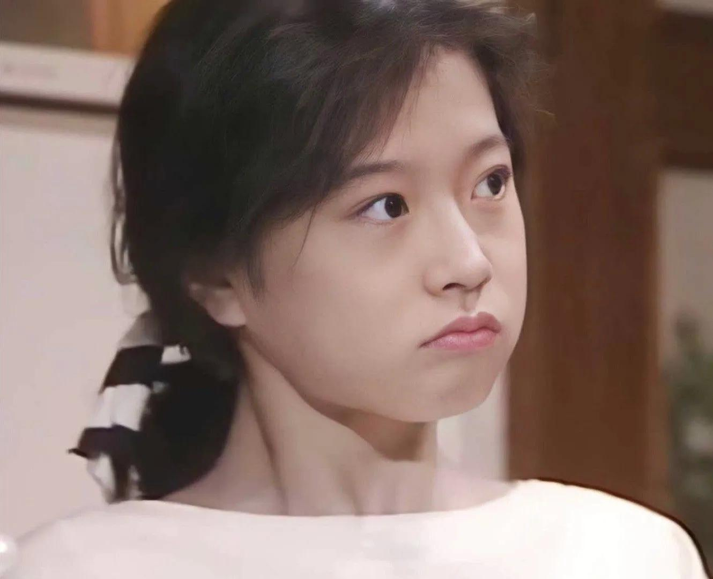

# 2022年度书单

2022年的最后一个月也已过半，想着是时候整理一下今年的阅读，但很惭愧，阅读小记这个环节并没有被我做的很好。有些读完之后就没再写文记录，有些则更是读至半本，甚至是只读了第一章就束之高阁。我的借口很多，比如上半年即将毕业，琐事缠身，下半年初入职场，为钱奔命，比如有些书看了一点后提不起兴趣，总之，都可以理解为犯懒。争取明年做得更好！

“万物皆可阅”，这是王烁老师在去年他的年度书单中提到的，游戏分类成为了他上一年度总结正式增加的内容。“阅”的对象不再只局限于文字，阅人阅事，当有更广大的载体，所以今年我也加入了影视、音乐、游戏等分类。

## 小说

今年对我来说是小说大年，今年所看的书过半都是小说。原因有二，一是小说本身带有强烈的故事性，阅读起来不费劲。今年是我步入工作的第一年，摘掉学生的标签后，最直观的感受就是不再对时间拥有绝对的支配权，用琐碎的时间读小说，相对来说会轻松些。二是小说中的人物更能让我看见具象后的“人”，有具体的事件背景，有具体的人物性格，有看似荒诞却又合情合理的人物选择……相比于数据之下抽象的人，小说中的人更能帮我看见人的多样性。

### 红楼梦，人民文学出版社

去年年尾至今年二三月份断续读完《红楼梦》，同时也浅尝了蔡义江的《红楼梦诗词曲赋全解》。《红楼梦》中出现的人物太多，刚开始读的时候，不对着人物关系谱，总是会忘记谁和谁是表姐妹，谁和谁是堂姐妹，谁和谁是亲家，谁是谁的丫鬟，谁又和谁有一腿。说实话，过年走亲访友时我自己的亲戚我都没有理明白过，理清这些，对我来说属实是一个大工程。

《红楼梦》里我觉得最完美的人物就是薛宝钗，才貌双全，心思细腻，游离于各种关系之中，处理什么事情都游刃有余，如果不是贾宝玉和林黛玉有“还眼泪”的设定，我很难想明白为什么贾宝玉选择的不是薛宝钗。明明贾宝玉被林黛玉PUA那么多次。可能这就是爱情为人所不解的地方吧。

薛宝钗最令我欣赏的地方，还是她处理事情的方法，每每遇上大事，薛宝钗的决策总是让我眼前一亮，保全面子，又不失利益。

### 安娜·卡列尼娜，列夫·托尔斯泰（中文版为草婴译本，英文版为企鹅社译本）

列文倾心于基蒂，基蒂却痴情于弗伦斯基，弗伦斯基在看见安娜后就将基蒂抛掷脑后，与安娜一见钟情。

每每看见类似的情节，我就不禁想到伏尔泰的一句话——“人的本能是追逐从他身边飞走的东西，却逃避追逐他的东西。”

安娜求得自己以为是完美的爱情，最终却走向自杀的结局，我不知道她有没有后悔，但我知道她需要解脱。

### 老妓抄，冈本加奈子

年岁有加，可到底什么才是生命的意义支点？

### 天龙八部（新修版），金庸

工作后的第一个月里，我有大量的通勤时间，正巧和朋友聊起佛学时谈及金庸，于是乎，我又看起了《天龙八部》。

再读《天龙八部》时，我更关注的是乔峰的故事线，以前更关注段誉，主要还是因为刘亦菲演过王语嫣。

乔峰故事线的主调是“误会”。贵为丐帮帮主却又是契丹后人。他退位后想要去查清“真相”，却又背上“弑父弑母弑师”的罪名，查询真相的途中，与真相相关的人接连被杀，武林中人皆道是乔峰所为，谓乔峰人人得而诛之。之后乔峰误以为段正淳是幕后主使，阿朱又得知段正淳是自己的生父，最后阿朱易容成段正淳与乔峰相见，最后被乔峰一掌打死。

在少林寺的武林大会上，一切真相得以揭示，乔峰口中陷害自己的大恶人却是自己的生父萧远山，而这一系列冤案的源头都要追溯到三十年前，少林寺方丈误以为萧远山要入侵中原而在雁门关外劫杀了萧远山一家。而这场误会又因慕容博欲挑起契丹与大宋的战争从而复国所假传的消息而起。

萧远山与慕容博可谓是仇深似海，在扫地僧让他们体验过身死之后，大仇得化，遁入空门。

想来对凡人而言，只有身死，才可视一切为空。可都身死了，空不空又有什么所谓呢。

### 书剑恩仇录（新修版），金庸

反清复明的江湖版本，相较于政治权力，江湖势力可谓鱼虾，所谓道义，在满是算计的场合，有不如没有。

### 雪山飞狐（新修版），金庸

看到田归农自尽，觉得倒是便宜他了。“一个人活着， 就未必比死了的人快活。”

看见苗若兰说“我知道你是好人。我没见你面的时候就知道啦！大哥，你可知在什么时候，我这颗心就已交了给你？”的时候，老夫的心都化了！

### 白痴，陀思妥耶夫斯基

罗翔老师曾在视频中多次提到陀思妥耶夫斯基，并且也提及了“要爱具体的人，不要爱抽象的人”——这句话也被疯狂转载而成为网络金句。

梅什金公爵是一个虔诚的基督徒，他的真诚和理想主义使得他被旁人称为白痴，纳斯塔霞则是大资本家托茨基的养女、情人。在托茨基决定将纳斯塔霞嫁给别人，转而迎娶别的贵族小姐时，梅什金公爵知道了这件事。梅什金公爵因自己虔诚的基督信仰以及对纳斯塔霞的悲悯而告诉纳斯塔霞自己爱她，愿意娶她为妻。而梅什金公爵之后又爱上了阿格拉雅，可梅什金公爵因为自己对纳斯塔霞的那种超越的爱而让阿格拉雅感到绝望。

梅什金公爵把纳斯塔霞抽象成了一个受尽磨难的人，他对纳斯塔霞的爱出于信仰、同情、怜悯、道德……纳斯塔霞在给阿格拉雅的信中提到——爱一个抽象的人，其实就是爱自己。

可抽象的爱，是永恒的。

### 卡拉马佐夫兄弟，陀思妥耶夫斯基

在读。

只能说犯懒现象严重，从开始翻这本书到现在少说有近两个月了，只读到第四卷，期间翻了翻马丁老爷子的《Fire and Blood》和尼采的《悲剧的诞生》，但都只是翻了翻。

阿辽沙是老卡拉马佐夫最小的儿子，姜文的《太阳照常升起》中也有一位阿辽沙，不知道里面有没有什么关联。

## 经济

### 置身事内，兰小欢

去年王烁老师在年度书单中提及的书，论及中国最大的经济操盘手——政府，这本书写给每一个身在中国的人，置身事内。

书中第六章讲债务与风险时有这样一段话：

> 债务带来的经济衰退还会加剧不平等，因为债务危机对穷人和富人的打击高度不对称。这种不对称源于债的特性，即法律优先保护债权人的索赔权，而欠债的无论是公司还是个人，即使破产也要清算偿债。以按揭为例，穷人因为收入低，买房借债的负担也重，房价一旦下跌，需要先承担损失，直到承担不起破产了，损失才转到银行及其债主或股东，后者往往是更富的人。换句话说，债务常常把风险集中到承受能力最弱的穷人身上。

要同时为储蓄和借贷设阈值，成为打工人的第一年，这对我来说是最重要的警醒。

## 社会

### Woman: An Intimate Geography, Natalie Angier

本书反驳了传统进化心理学对女性的认识。

现代社会女性群体表现的偏好，也许是男权社会的产物，是社会化的结果，而并非是已经写进基因的定式。

## 哲学

### 与孤独为伍，尼采

类似《论语》和《沉思录》的语录，例举部分：

> 1. 一个人看上去有个性，是因为他办事总依着自己的性情，而不是遵照规则。
> 2. 如果彻底了解，就很难忠诚。因为了解越深入，就越会接触到黑暗面。
> 3. 特立独行的人总是令人反感，因为他们与众不同的方式使周围的人感到自卑。
> 4. 某人故去时，我们通常需要令人安慰的解释，与其说是为了平复痛苦，不如说是为自己的痛苦轻易得到平复寻找借口。
> 5. 背离传统的人成为传统的祭品，坚守传统的人成为传统的奴隶。无论哪种情况，毁灭都随之而来。
> 6. 自负就像传说中的金羊毛，能保护你免受鞭笞，却抵御不住微小的刺痛。
> 7. 最好的东西莫过于我在众人之中体验和养成的深深宁静，而我的收获则是他们无论用火还是剑都无法夺去的。

## 其他

### 爱你就像爱生命，王小波

王小波的爱情文集，已经是第三次看这本书了。属实是自己感受不到爱情的美好，就看看别人的爱情是什么样子。

## 影视

### 安娜·卡列尼娜，苏菲·玛索主演

改编的如何不谈论，我只是冲着苏菲·玛索去的。

### 傲慢与偏见，凯拉·奈特利主演

我没有看过原著，在维基百科上查阅资料的时候看见本书原名为*First Impressions*，描述的大概就是达西先生对伊丽莎白的一见钟情。

达西先生——我爱你，但我不说。

### 红猪、幽灵公主、风之谷，宫崎骏

less is more. 

### Rick and Morty TV Series S01-S06

As well, less is more. 

Wubba Lubba dub-dub! 

### 情书，岩井俊二

剧情发展偏慢，只有到了结尾，翻转借书卡后出现那幅画像的时候，才会有隐隐作痛的感觉。

很符合日本“哀”的文学范式。

## 歌曲

事先声明，我不懂乐理，只是觉得好听，或者觉得作词比较喜欢。

### プラスティック・ラブ(plastic love)，竹内玛莉亚

21年1月份的时候，小柳翻唱了《Plastic Love》，我很喜欢，我在宿舍里播放了这首歌不下百遍，歌词大概就是描述了一位为爱受伤的女人成为渣女后的独白。

其中一段歌词的大意是（翻译来自网易云音乐）：

> 我就只学到了这些把戏，对不起啦！
> 千万不要对我动了真情
> 恋爱于我不过是个游戏
> 玩得尽兴就够
> 掩饰我封闭心灵的气派礼服和鞋子
> 都是我孤独的伙伴

歌曲无论是作词还是作曲都颇有特色。查阅相关资料的时候才知道这是活跃于日本1970年代末期至1980年代末期的City Pop风格。在2017年，竹内玛丽亚的《Plastic Love》因未经授权上传到YouTube，因数据算法意外推荐给全世界的用户后，许多用户开始将《Plastic Love》视为神秘的歌曲，结果受到日本以外地区的热烈注目。2019 年，日本华纳音乐在YouTube上传了一支先行版MV。

### Crimson，中森明菜(album)

我不装了，我摊牌了，我是颜粉。

《Crimson》是中森明菜的第十张专辑，这张专辑由竹内玛莉亚和小林明子每人作曲五首。

其中，《OH NO, OH YES!》由竹内玛莉亚作词作曲，椎名和夫编曲。有一段歌词很有意思：

> Oh no, loving you is not right
> But no, don't take me home tonight
> Oh yes, so baby won't you hold me tight

《Crimson》中歌曲的大意，基本都是生活在都市里的女人，在不同故事下的自我表达。

《对Mick Jagger微笑》这首曲子也很有意思，开头是磁带机的操作声响，磁带播放之后，响起的是老式打字机的声音，随后是打字的人跟着哼唱，直到歌曲过半的时候，主人公的现实声音才淡出，歌声才从背景声转为前景声。而这样的歌声才持续一分钟，就又从前景声转为背景声了。

题外话：竹内玛莉亚也为松隆子创作过歌曲。小新有句名言——“对不起，我对二十二岁以下的没兴趣，不过松隆子例外。”

### Demo3，陈绮贞 (album)

可以说这是我遇见的最有意思的专辑了。

本专辑收录了陈绮贞老师的15则配有吉他演奏的口白，短则一句话，多则数十句，还有一首单曲《九份的咖啡店》。

### BTTB，坂本龙一

这张专辑发现得很偶然。

近一个月都在研究Opus codec，一个音频的编解码器，有一天在准备搜索资料的时候，脑抽地打开了网易云搜索了opus，搜索结果的第一个就是坂本龙一的《Opus》。

1999年末，坂本龙一在日本推出了一张个人钢琴独奏专辑《BTTB》，《BTTB》取名于Back To The Basic。

钢琴曲专辑，对不懂乐理的我来说，less is more

## 游戏

### Elden Ring, From Software

 From Software今年的新作品，毫无意外，今年也是神坛跌向宫崎英高的一年，《Elden Ring》斩获今年TGA年度游戏大奖。我依然记得它是今年2月25日发售的，因为那天是我坐上高铁回学校的日子。26号之后的一周内，我玩了70个小时，尚未通关，因为得写论文。最后一次打开是4月20日，别问，问就是在等DLC。

至今还记得跪在拉塔恩面前的十小时，只能说，魂味十足。

同样的，这一作的基调依然是悲剧，命定的悲剧。

在命运面前，选择臣服还是抗争？

在压倒一切的命运前，人是多么渺小，连半神马莲尼亚也是如此。
