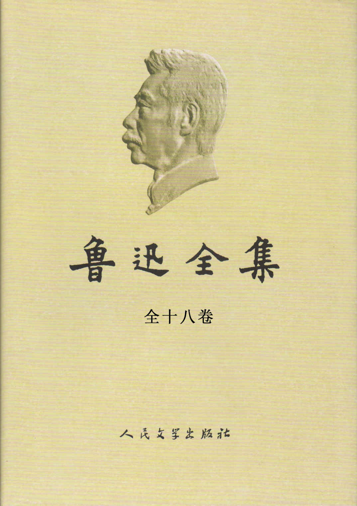
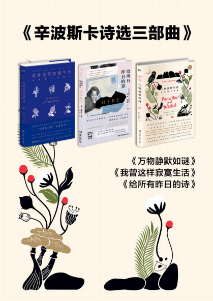
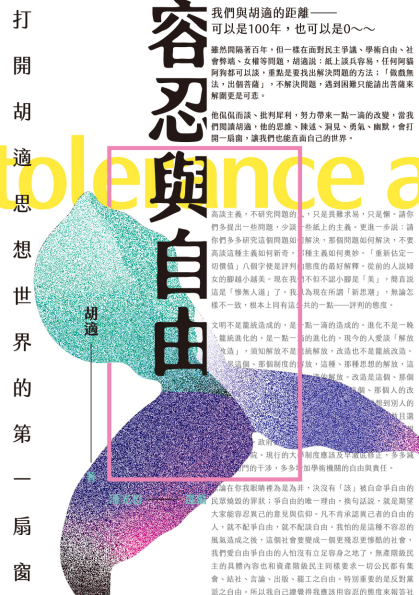

# 2023年度书单

## 前言

今年依然会列举一些看似与“书”无关的内容——音乐、影视、游戏，还有今年新增的摄影、演讲和公开课。原因详见去年书单[《2022年度书单》](https://mp.weixin.qq.com/s?__biz=MzU3NDgyNzYwNg==&mid=2247484643&idx=1&sn=59e21b48bb02eed65cf3cc82329d29ac&chksm=fd2d39daca5ab0cc92f27f9b59185b862a140cdd5e7fa9ded7a9b3859db5b863775998a5a413&token=1936453047&lang=zh_CN#rd)的前言部分，此处不再赘述，往后将亦如此。

今年书单的整理形式与以往不同。往年我的书单我都在年末的最后一个月才开始整理，由于年初看书时有些想到的内容我没有及时记录，所以到了年尾总结时，难免会遗漏掉一些本来已想到的内容，甚至直接缺少了某本看过的书。今年则是尽量做到了每月都更新一下本年度书单的内容，避免了内容的缺失，也保证了长文写作应有的修订量。当然我也有犯懒的时候——有近两个月的时间没有更新过本文的内容。

## 小说

### 呐喊、彷徨、野草、朝花夕拾，鲁迅

今年3月份时，城镇青年调查失业率达到15.3%，“孔乙己文学”一词火爆网络。我已忘记《孔乙己》一文的具体内容了，只记得大概，秉持着不能错用概念的原则，我翻阅了《孔乙己》 的原文，以求了解鲁迅先生当时想通过孔乙己这个角色具体表达什么。

读着读着，几本短篇小说集倒是都读完了，论文集也粗略翻阅了几篇，但以我似有非有的文学素养，鲁迅先生想表达什么，我不敢妄下定论。

### 盐镇，易小荷

## 诗集

### 鲍勃·迪伦诗歌集 1961-2012

鲍勃·迪伦，第一位获诺贝尔文学奖的歌手。他的作品中，我听的第一首，也是最长听到的一首就是《Blowing in the Wind》。

> How many roads must a man walk down
> before you call him a man?

### 万物静寂如谜、我曾这样寂寞生活、给所有昨日的诗，维斯拉瓦·辛波斯卡（湖南文艺出版社）

### 辛波斯卡诗选，维斯拉瓦·辛波斯卡（桂冠世界文学名著）

### 一百首爱的十四行诗，聂鲁达

写情诗的时候抄一抄。

### 罗门诗选，罗门

### 台港爱情诗选，培贵编（长江文艺出版社  1987年）

## 杂文

### 容忍与自由，胡适（台湾商务印书馆）

胡适，安徽绩溪人。我也是绩溪人，作为绩溪人怎么能不读胡适呢？

此版为台湾商务印书馆出版，与在大陆出版的《容忍与自由》在收录文章的内容和数量上都有些许差异。

### 退步集续编，陈丹青

> 一退再退，所为者何？

## 经济

### 置身事内，兰小欢

去年读过一遍，今年再读，温故知新。

21年末，王烁老师在自己的年度书单中介绍这本书时这样写道：

> 出自中国学者之手，以普通人能理解的讲述，讲明白中国经济中的最大那一只大象——政府——如何起作用，与经济发展的现实基本同步。作者定书名为置身事内，我猜有两层意思，一层是设身处地去理解，一层是后果事关每个人。此事无人可以置身其外。

再读这句话的时候，我想起19年年初的寒假，在和好友吃饭时，我被问道：“关注国家经济有什么用？这种宏观的东西与你有什么关系，你能控制吗？”

彼时我回答道：“这些只是我的个人兴趣。国家经济如此庞大的系统，岂是我能控制的了的。不过只是同娱乐新闻一样，消遣着看看”

如今再看这个问题，我的答案会有些许不同。我关注这些信息，不为控制，只为发声。面对国家经济这样的巨型机器，你我皆蚍蜉，何以撼大树？但你我皆在系统之中，置身事内，你我的经济决策无一不在影响国家经济的走向，大到买房买车，小至吃饭出行。单看你我，确实依旧影响甚微，但千千万万人的经济决策汇集起来，就形成了宏观的经济数据。准确的经济数据，就是经济系统内部的反馈，我根据系统内部的反馈，再调节我的经济决策，就是我在经济行为上的发声。“雪崩发生时没有一片雪花是无辜的”，这句话在谈论经济走向时，我觉得同样适用。

今年5月份时，财新的一则《青年失业率首破20%》的推送冲入我的眼球，此后我开始和经济学在读的表妹关注起了中国当下的经济数据——6月居民消费价格环比下降0.2%，

看书中对地方财政运作的阐述，再看如今的房产经济的走向，不免长叹。

## 哲学

### 洞见：从科学到哲学，打开人类的认知真相，罗伯特·赖特

本书英文原名为《Why Buddhism is true》。因此，这是一本讲佛学的书。

## 音乐

今年，我本想将由纯乐器演奏的“音乐”和由演唱者演唱的有歌词的“歌曲”分为两个部分，这是因为我对上述两者有了一个新的观点——二者在表达内容时的抽象程度不同，前者依靠单纯的旋律来表达，后者则不仅依靠旋律，同时也依靠歌词来表达。而对于听众来说，前者更依靠纯粹的听觉去感受内容，后者则可以选择在旋律之外通过歌词去理解内容，前者需要听众有想象力，后者有时则需要听众有一些文学欣赏能力。相较而言，我个人觉得“歌曲”是比“音乐”要好“懂”一些的。

二者不同，但也都离不开“旋律”这一核心。我在初中阶段接触了大量的日式动漫，ACG歌曲是我最早接触的非中文歌曲。之后我又为学好英语而开始听欧美歌曲。时至今日，很多日韩乃至欧美的歌曲我依然听不懂歌词，但是这也并不影响我欣赏它们的旋律。

陈绮贞——我很喜欢的一位音乐创作人——在今年颁发第34届金曲奖的时候有如下致辞：

> 一首好歌，要有隽永的歌词，动听的旋律，歌手无可取代的诠释，还有高品质的幕后制作，最好，还要符合时代精神。

好的歌曲，当是文学与音乐结合的产物。

最后，我还是将“音乐”与“歌曲”放在了同一部分，因为本质上，它们都是在表达人类的同一部分。

### Paganini: Diabolus in Musica (帕格尼尼：魔鬼之音)

### 爱上你就会失去你（单曲），王祖贤

先附上歌词：

> 这到底是什么样的游戏（这大概是场很奇怪的游戏）
> 如果不去爱，我们就不会失去（一旦陷入，就很难领悟）
>
> 这到底是谁定的规则（这难道是爱情的宿命）
> 一旦拥有，就要开始担心失落（一旦拥有，就不能在乎天长地久）
>
> 越爱上你，越失去你
> 越留恋你，越抓不住你
>
> 还没有离开你，就开始想念你
> 觉得好像还没有开始好好爱你
> 好好爱你，好好爱你
> 就失去你

如果爱上你，结局注定只能是失去你吗？

如果爱上你，结局注定只能是失去你，那我还会爱上你吗？

“还没有离开你，就开始想念你”

## 游戏

### 塞尔达-王国之泪

## 摄影

## 演讲

### 梁文道：一枝筆的認同與效忠——我的身份省察報告

### 许子东：重讀阿Q：奴才還是奴隸？——魯迅誕辰140周年

### 郭初陽：學語文不需要語文書

### 歐麗娟：孤獨的多棱鏡

### 黃盈盈：小姐研究二十年

### 賀欣：離婚中的男女不平等

### 王雲珂：擇偶與偏見——在性研究領域，我們自動忽略了那些不渴望交配的大多數

### 马云：2020外滩金融峰会演讲

## 公开课
