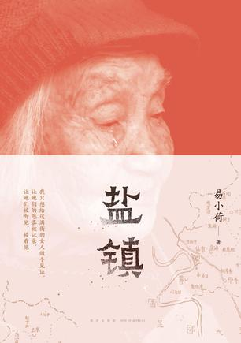

# 2023年度书单

## 前言

今年依然会列举一些看似与书无关的内容，原因详见去年的书单前言[2022年度书单](https://mp.weixin.qq.com/s?__biz=MzU3NDgyNzYwNg==&mid=2247484643&idx=1&sn=59e21b48bb02eed65cf3cc82329d29ac&chksm=fd2d39daca5ab0cc92f27f9b59185b862a140cdd5e7fa9ded7a9b3859db5b863775998a5a413&token=1936453047&lang=zh_CN#rd)

## 小说（短篇小说集）

### 呐喊、彷徨、野草、朝花夕拾，鲁迅

### 盐镇，易小荷

## 诗集

### 万物静寂如谜、我曾这样寂寞生活、给所有昨日的诗，维斯拉瓦·辛波斯卡（湖南文艺出版社）

### 辛波斯卡诗选，维斯拉瓦·辛波斯卡（）

### 二十首情诗与绝望的歌，聂鲁达

### 罗门诗选，罗门

### 台湾诗选（二），人民文学出版社1982年初版

## 杂文集

### 容忍与自由，胡适（台湾商务印书馆）

胡适，安徽绩溪人。作为绩溪人怎么能不读胡适呢？

### 退步集续编，陈丹青

一退再退，所为者何？

## 经济

## 哲学

## 歌曲

## 游戏

### 塞尔达-王国之泪

## 摄影
