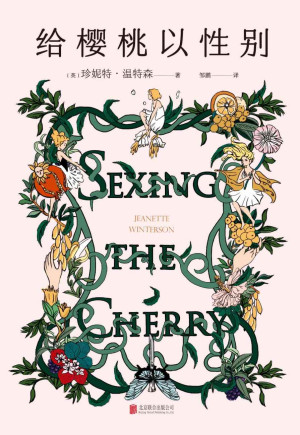
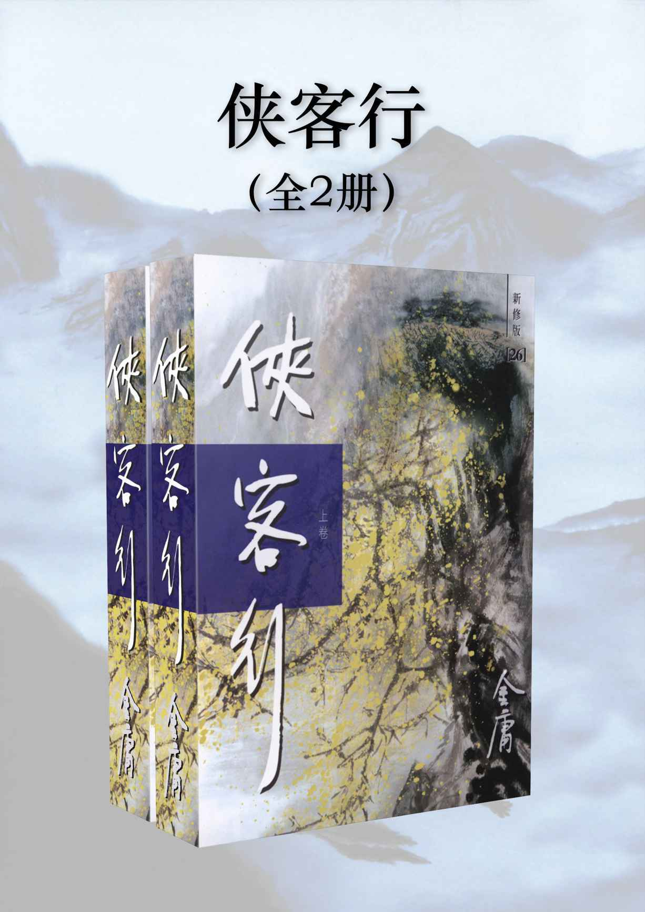
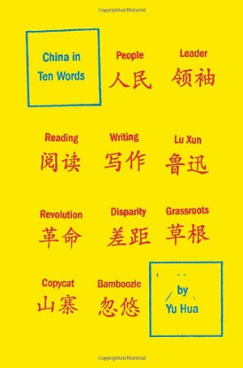
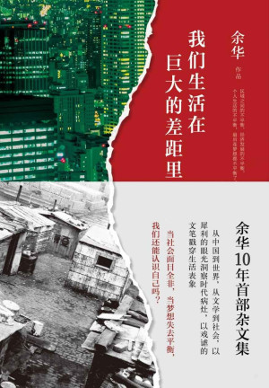
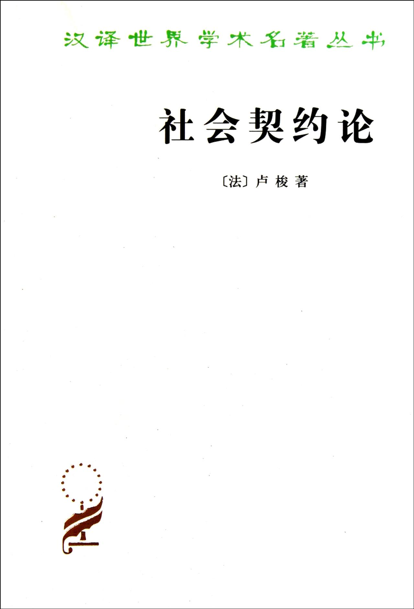

# 2024 年度书单

## 前言

今年又是一个读书很少的年份。

被堆在床头的旧书也好，喜欢的作者今年出版的新书也好，很多都只是我心血来潮时看了一两天，甚至只是看了两三个小时，就抛在脑后了。从去年下半年开始（准确点来说是瓦的国服上线），大多时间都被用在了打游戏上。说好的读书笔记，今年也没做什么。

又是年初立志，年中放羊，年尾再立志。

说到游戏，不知道各位是否在老头环的 DLC 里看见了隐藏在梅瑟莫无尽盼望背后的绝望。又是否见到了黑神话里，悟空为摆脱金箍而入轮回。

在阅读上，我也发现今年的我，有了的两点变化，两点很大的变化。

第一，我不再能一口气读完一本书了。连 25 万字都不行。刚毕业时，勉强还能在周末一口气读完三四十万字，现在则完全不行。注意力被各种各样的讯息冲散，即使已经把社交软件和邮件的通知再三简化，也还是会时不时地被手机或电脑吸引了去。

第二，我对世界的好奇心变弱了。以前还会涉猎一些看似奇怪议题的书，或者说是什么议题的书拿上手都能看，现在就会开始觉得有些议题很没意思了，不对胃口。

关于今年的「年度书单」，我也新增了一些文章。有我在为解决工作问题时发现的一些大佬写在 Blog 中的文章，也有专栏作家写在报刊中的文章，也有微信公众号中的文章。我觉得这些文章都具有启发性，值得一读。

十月份时，我也通过 Notion 将「翻香令」的文稿发表出来，支持 Markdown 编辑，支持外部引用，还支持网页嵌入。欢迎各位移步 Notion 阅读。

在此放出 Notion 主页的链接：[翻香令](https://www.notion.so/66cf695834ef46d38556d7321965b5e1?pvs=21)

当然，GitHub 上的文稿也会同步更新。

## 小说

### 给樱桃以性别，珍尼特·温特森

这是年初我生日时，琼送我的生日礼物。

魔幻现实主义，POV 的写作手法。读来仿佛身处暗黑童话之中。

### 侠客行，金庸

一位金庸粉丝的消遣读物。

读金庸武侠，时不时会感叹一句，all destiny。虽然读别的作品也偶有「造化弄人」之叹，但金庸的作品尤是如此。

## 诗集

### 夜行性動物，徐珮芬

我忘记了是在哪个书展上看见的徐珮芬，一位当代台湾青年诗人。

闲着的时候读了两本。这本诗集中的大部分诗像极了现在的流行音乐，聊来聊去都是情爱。还多半是负面感受。我不知道是作者真的有如此之多的「爱情洞察」，还就是「为赋新词强说愁」。开始会很新奇，多读几首就会腻。

悲观看待爱情的人不妨一读，应该全是共鸣。

### 在黑洞中我看见自己的眼睛，徐珮芬

相比于上一本，这本诗集就多了更多的个人观察。

### 瘦骨嶙峋的愛，李豪

在检索徐珮芬时找到的另一位台湾诗人。

作者将诗集分成了四辑，标题分别是 Be Patient, Be Fine, Be Balanced, Be Kind。刚看见时觉得很有趣，作者好像把幸福生活的方法都列举出来了。

在后记中，作者提到，书名《瘦骨嶙峋的爱》来自于美国民谣乐团 Bon Iver 的《Skinny Love》，标题内容，也由这首歌的歌词演化而来。

[Skinny Love](https://music.163.com/song?id=16649888&userid=425197922)

### 痖弦诗集，痖弦

我偏爱其中记录历史的部分。

## 杂文

### China in ten words, 余华

### 我们生活在巨大的差距里，余华

有段时间在抖音上一直被推送这本书，视频里都说这是余华十年首部杂文集，连书的内容简介都这样写道：「《我们生活在巨大的差距里》是余华自 2003 年以来的首部杂文集。」

《我们生活在巨大的差距里》出版于 2015 年，《十个词汇里的中国》出版于 2010 年，但最早却是以法文出版，2011 年才在台湾和美国出版。

《我们生活在巨大的差距里》算是《十个词汇里的中国》删减再填充的产物。

### 看见，柴静

「看见一个个体或群体」，并不只在于「看见」这个个体或群体如今的样子，而在于「看见」他们是如何成为，又「理解」他们是为何会成为如今的样子。

这是我对「看见」二字如今的理解。这个理解，来自于蔡崇达的《皮囊》，也来自于柴静的《看见》。

柴静和白岩松，是我高中时期最喜欢的两位媒体人。柴静 12 年出版《看见》，14 年离开央视，15 年自费拍摄调查纪录片《穹顶之下》。此后柴静便不再出现在公众视野中。直到去年 8 月 17 日，柴静突然间地在 YouTube 发布了新纪录片——《陌生人——柴静对话圣战分子》——的预告。在更新完此部纪录片之后，她开始陆续更新个人访谈的视频。

柴静的置顶*tweet*

重读《看见》，既是为了「看见」柴静眼里的中国和中国人，也是为了「看见」柴静。

## 哲学

### 社会契约论，卢梭

### 论自由，约翰·穆勒

今年早些时候，我有在公众号发过两篇对「自由」二字的浅薄见解，写作期间有粗略地翻过上述的两本书。

「服从自己为自己制定的律法，即为自由。」

为充满矛盾的自我寻找律法，也许就是你我一生的课题。

「执中无权，尤执一也。」

## 社会

### 过渡劳动：平台经济下的外卖骑手，孙萍

导师推荐。

过渡劳动，指的是一个人从一个阶段向另一个阶段过渡时，从事的劳动。

> 如何理解“过渡劳动”这一概念？过渡劳动阐释的既是一种过程，也是一种结果。
>
> 作为过程的“过渡劳动”，强调的是这种短暂和过渡的生成性。它在一种强调自由同时又充满监管的语境下生成，参与其中的劳动者需要面对来自技术系统的监管、城乡与阶层的区隔、性别化的自我认知，以及将“自我”作为决策主体的能动性展示。

我曾以为外卖骑手的年龄分布应该更窄，均值也应该偏高，大概高于三十岁。然而现实是，21 ～ 30 岁，占 51.0%，31 ～ 40 岁，占 37.1%，约七成的外卖骑手年龄小于 35 岁。且群体近半数都有负债。

这个群体，远比我所想的更艰难。

## 健康

### 控糖革命，杰西·安佐斯佩

大四一年，我胖了近 20kg。不注意饮食加缺少运动，最终造成了如今死肥宅的模样。我总是和朋友吐槽，40 斤的猪肉得有多大一堆啊。

葡萄糖和脂肪的相互转换公式，早已被写在高中生物课本上，但想要实际减重，还是需要点科学的方法。

控制体重的首要就是控制葡萄糖水平，但是控糖的重要性，并不只在于减少葡萄糖向脂肪的转化。葡萄糖水平同时还影响着食欲、精神状态、睡眠、记忆力等。作者在描述葡萄糖的重要性时，将葡萄糖比作飞机的操纵杆，而人体就是那架飞机。只有掌握了操纵杆，才能掌握整架飞机的航行。

作者在书中列举了很多控糖小窍门，我列举其中我觉得比较好操作的部分：

1. 在开始用餐时，先吃绿色蔬菜。
2. 减少早餐中含糖食物的比重。
3. 饭后运动。
4. 偶尔的放纵餐更能帮助人体抑制对食物的渴望。
5. 保持适当的饥饿（不要吃太饱）。

说说我个人的结果。从今年的 6 月份，我开始进行有计划地控糖，到 11 月初，我已经减少了约 8kg 体重。期间的多数时候，我都没有刻意增加运动量，毕竟我懒癌晚期。

控糖的第一个月也没有什么很大的成效，体重总是在的浮动，减少 3kg 后又回去。到 8 月中旬我再一次上称时发现，体重相较于 6 月份时，已经减少了 5kg。在这之前并未频繁记录体重，所以这一次的惊喜较多。之后我就尽量保持每天记录体重，观察身体的变化。每天记录的坏处就是惊喜没有了。体重并没有被很平稳地保持，体重曲线在这段频繁记录的时间内与开始控糖时高度相似，降了又升，升了又降。但好在把时间轴拉长，还是能看见体重在减少。

### Influence of intermittent fasting on autophagy in the liver

发表于 2023 年的论文，讲述了间歇性禁食后，人体内多种代谢效应、激素水平产生变化，以及开启肝脏自噬的部分机制。

作者在文中提到，间歇性禁食促成的肝细胞自噬的激活，有着维持能量平衡，改善线粒体功能，控制肝脏质量等效果，从而能缓解肝脏代谢性疾病，改善肝脏炎症。

论文中提到了四种禁食方式：

有按照能量计算的方案，也有按照时间计算的方案。文中并没有详细阐述具体哪一种方案更好，但是从实际操作的角度来说，还是 8+16 的禁食方案（8h 进食+16 禁食）好操作一点。毕竟一整天的禁食和计算准确能量，相较来说都比较难达成。

文中也特别强调，间歇性禁食对肝脏自噬的影响和机制在系统水平上尚不清楚。该食用哪些类型的食物，以及如何进行体力运动，目前还尚未有更为安全的指南。

## 文章

### 编程的门槛，云风

[编程的门槛](https://blog.codingnow.com/2006/08/aiaea.html)

编程是建立在逻辑之上的，即使懂得了经验上的复用，但未必能懂得逻辑上的构成。

### The Forty-Year Programmer, Noah Gibbs

[The Forty-Year Programmer](https://codefol.io/posts/the-forty-year-programmer/)

「人生不是短跑，也不是马拉松，而是记日记。」

### 如何渡过历史的垃圾时间，清和社长

[如何渡过历史的垃圾时间](http://www.personpsy.org/Info/Details/2819)

周期自有周期的力量，但在周期的下行段，等待就是更好的选择吗？

## 影视

### Last Days 坂本龍一 最期の日々, NHK

人生最后的阶段应该如何度过？坂本龙一给出了他的答案。

### House of the Dragon S1 & S2, HBO

番剧都是养肥了再看的，House of the Dragon 也不例外地被我养了两年，直到第二季更新了有四五集了，我才开始看 2 年前就下载好的第一季。

剧集改编自 A Song of Ice and Fire 的前传——Fire and Blood——中大约 1/4 ～ 1/3 的内容。Fire and Blood 更像是一部编年体的史书，讲述了 Targaryen 家族几代人的兴衰史。

剧集开始时，大概就是 Targaryen 家族最后的和平，随后就开始权力争斗，内部战争。这段斗争史，在书中被称作 The Dying of the Dragons。

偏见、仇恨、执念，淋漓尽致。

## 音乐

今年有太多喜欢的专辑了，在此推荐我的年度 TOP 5。

### Venice, Anastasia Kobekina

[Venice——网易云](https://music.163.com/album?id=179261168&uct2=U2FsdGVkX1/JyKqXtR9ajRo1xA5/cLCzcstdLJ88uzY=)

今年尤爱大提琴曲。相较于小提琴，大提琴音域更低，音色更为深沉。由大提琴所演奏的曲子，所表达的情感，也多半更偏安静、沉稳些。以前很喜欢一些带有点爵士风的小提琴曲，因为它们节奏感很强，富有激情。现在就更喜欢这种稍微慢一点的，甚至哀伤和悲愁多一点的。

这张专辑是今年 2 月初时，Apple Music 首页推荐多日的古典专辑。演奏者是俄罗斯大提琴家*Anastasia Kobekina* ，她在一月时获得*Leonard Bernstein Award*。

十分推荐其中的两首曲子，《Lamento d'Arianna》和《Ariadne's Lament》。

### EVOLUTION，EVO+

[EVOLUTION——网易云](https://music.163.com/album?id=3451491&uct2=U2FsdGVkX18NUua9BKJpZfyPRA+CBxWlMungm22bqP0=)

这是我今年听过最多次的专辑。

入坑曲是这张专辑中的《[A]ddiction》，听到这首歌的那一刻，我还以为这首歌是 GARNiDELiA 的歌，但是 GARNiDELiA 的歌我基本都听过。怀疑是美依礼芽早期的作品。一是感觉音色很像，二则是感觉编曲的样式很像美依礼芽最早的《Girls》。

专辑中除了摇滚还有节奏相对较慢的情歌，比如经过重新编曲并加入英文歌词后的《rain stops, good-bye》。这首歌最早出自 08 年的公主殿下。

我在 Niconico 上找到了原唱视频，以及我觉得很不错的翻唱的视频。

[https://www.nicovideo.jp/watch/sm3075492](https://www.nicovideo.jp/watch/sm3075492)

[https://www.nicovideo.jp/watch/sm6799447](https://www.nicovideo.jp/watch/sm6799447)

在原先的编曲中，钢琴和爵士鼓从一开始就交织在一起，雨天的柔和与内心的澎湃汇聚在一起。

而在新的编曲中，intro 的部分则由吉他独奏开始，后转向吉他与小提琴协奏，然后吉他声隐去，留下小提琴的尾音，之后进入一拍的沉寂，最后鼓声加入。就如同歌名描述的那样，雨停后，离去的强烈情感，在此爆发。而在 outro 的部分，那小提琴的漫长尾音，最令我着迷。一切的遗憾，都在时光中渐逝。

专辑中也包含了很多其他我个人觉得很不错的翻唱。

### SEXY ROBOT，当山瞳

[SEXY ROBOT——网易云](https://music.163.com/album?id=2081342&uct2=U2FsdGVkX19SktFQW1kco462TWCTyT4BD9VF5qERKDk=)

这是当山瞳在 1983 年发行的专辑，那正是 City Pop 盛行的年代。专辑中的《CATHY》也算是最能代表 City Pop 这一风格的歌曲之一了。

整张专辑的编曲都加入了很多电子合成器的元素，与专辑同名的这首《SEXY ROBOT》中就很充分地展现了这一点。

专辑中多首编曲中的鼓声，也是我很喜欢的部分。

> 小插曲：我在编辑音乐这一节的时候，将这张专辑推荐给了一位叫 Kathlyn 的学妹，然后她就发来了两张学生证给我看，一张是 Harvard，另一张是 MIT。真的，我最恨这种偷跑的人了，明明说好了只是去波士顿和剑桥玩的！

### 岁月如歌，曹芙嘉

[岁月如歌——网易云](https://music.163.com/album?id=2732147&userid=425197922)

全是经典！！！

### 望郷， 铃木常吉

[望郷——网易云](https://music.163.com/album?id=48489&userid=425197922)

如果你喜欢深夜，你一定会喜欢铃木常吉。

## 演讲

### 林小英：縣域教育何以成為一個話題

[https://www.youtube.com/watch?v=wxV3ceBmqWA](https://www.youtube.com/watch?v=wxV3ceBmqWA)

### 阮筠庭：那些被教育制度扔进垃圾箱的孩子，他们去了哪里？

[https://www.youtube.com/watch?v=4AohKyR5jME](https://www.youtube.com/watch?v=4AohKyR5jME)

## 游戏

### Cyberpunk 2077 Phantom Liberty, CD Project Red

CDPR 对于「剧情」和「选择」的掌握，依旧是世界之最。

没有《往日之影》，《2077》就不能被称作一部优秀的作品。
