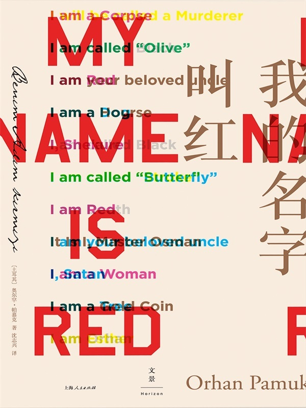

# 2024 年度书单

## 前言

## 行为

### How to Not Die Alone: The Surprising Science That Will Help You Find Love, Logan Ury

## 社会

### 社会契约论，卢梭

### 论自由，约翰·穆勒

## 小说

### 给樱桃以性别，珍尼特·温特森

### 我的名字叫红，奥尔罕·帕慕克

## 杂文

### China in ten words, Yu Hua

### 我们生活在巨大的差距里，余华

## 影视

### 周处除三害，黄精甫

### Last Days 坂本龍一 最期の日々，NHK

## 音乐
