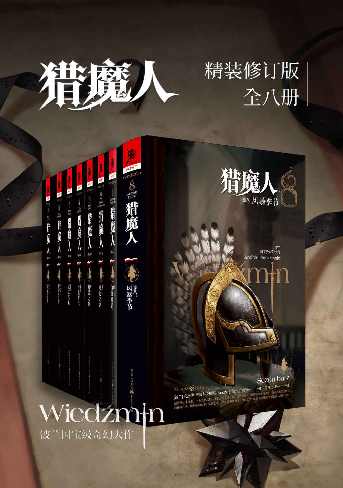
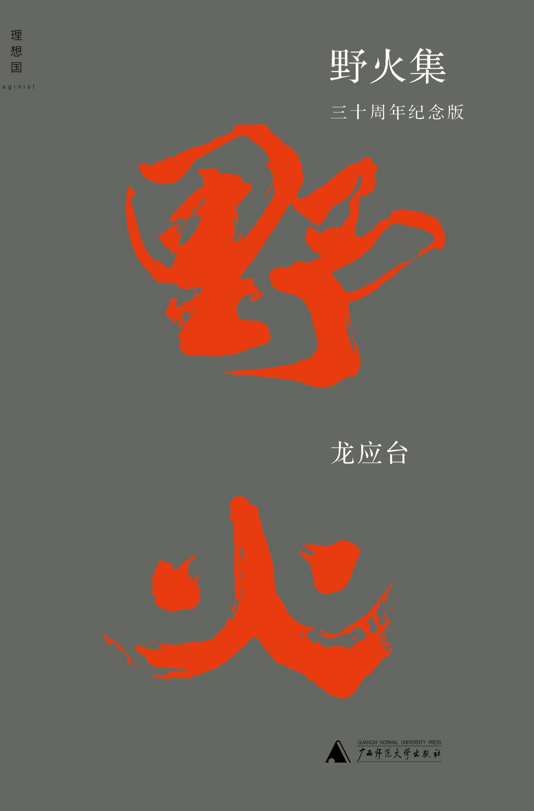
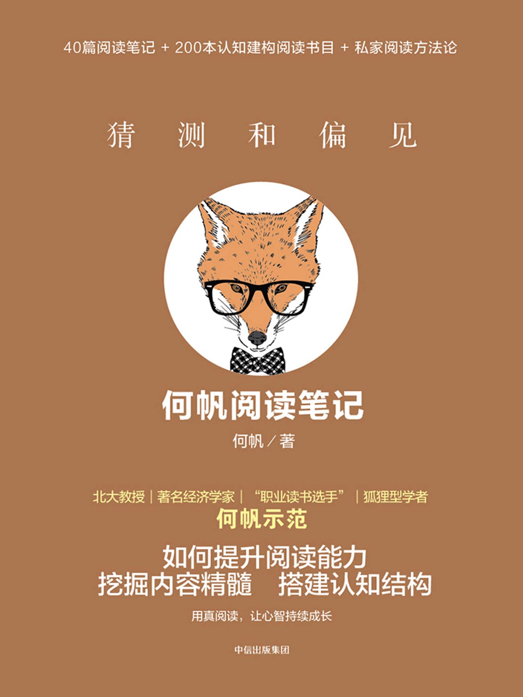
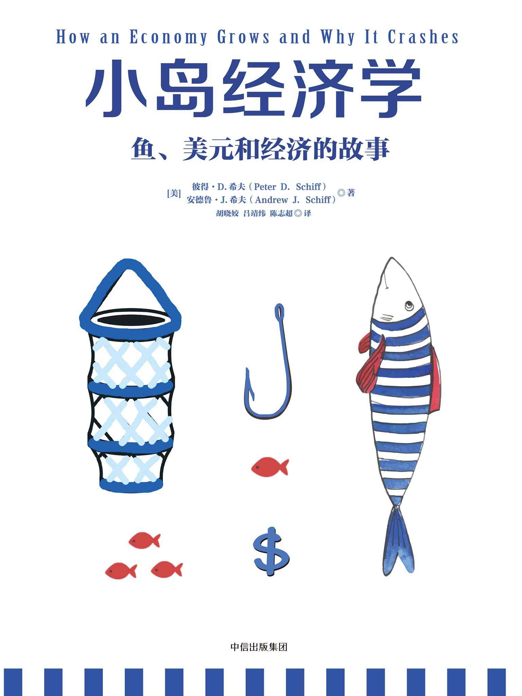
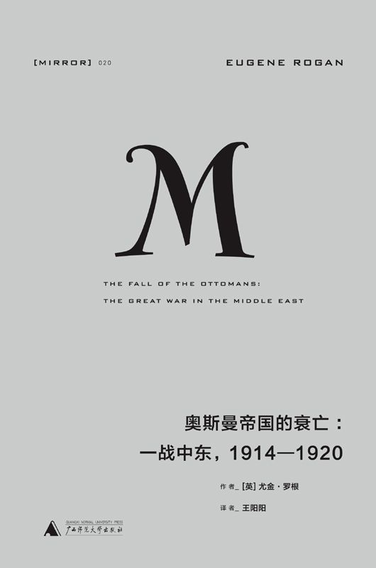
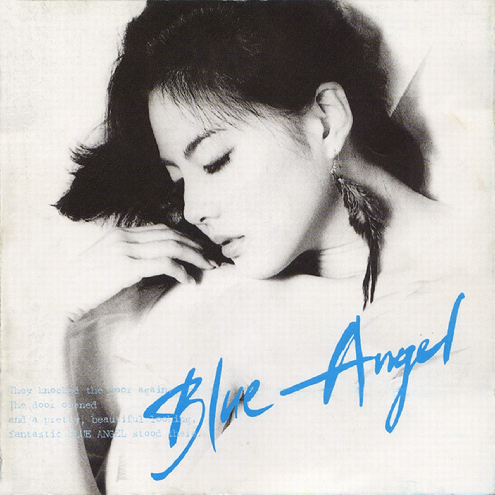
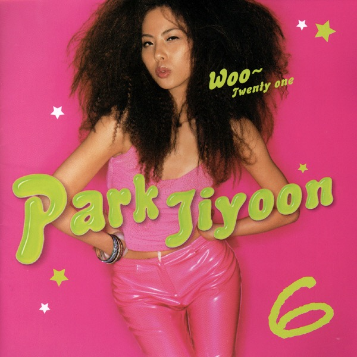

# 2026年度书单

## 前言

## 小说

### 猎魔人，安杰伊·萨普科夫斯基

## 诗集

## 杂文

### 野火集，龙应台

## 政经

往年都会把「政治」与「经济」分成两小节，现在则越来越觉得经济与政治交融的地方太多，遂合为「政经」一节。

### 猜测与偏见：何帆阅读笔记，何帆

### 小岛经济学：鱼、美元和经济的故事，彼得·希夫 & 安德鲁·希夫

## 历史

### 奥斯曼帝国的衰亡：一战中东，1914—1920，尤金·罗根

## 漫画

## 影视

## 音乐

### Blue Angel, 박지윤（朴志胤）

朴志胤的第二张录音室专辑，也是朴志胤与 JYP、方时赫、尹一相第一次合作的专辑。

录制这张专辑的时候，朴志胤年仅 16 岁，可无论是从专辑封面，还是从歌曲中的音色和情感表达，都很难让人相信这是由一位 16 岁的少女演唱的。倒是有些像中森明菜了。

### Woo~ Twenty One, 박지윤（朴志胤）

朴志胤的第六张录音室专辑，同时也是 JYP 监制的第三张专辑，以及 JYPE 生涯的最后一张专辑。

## 游戏
