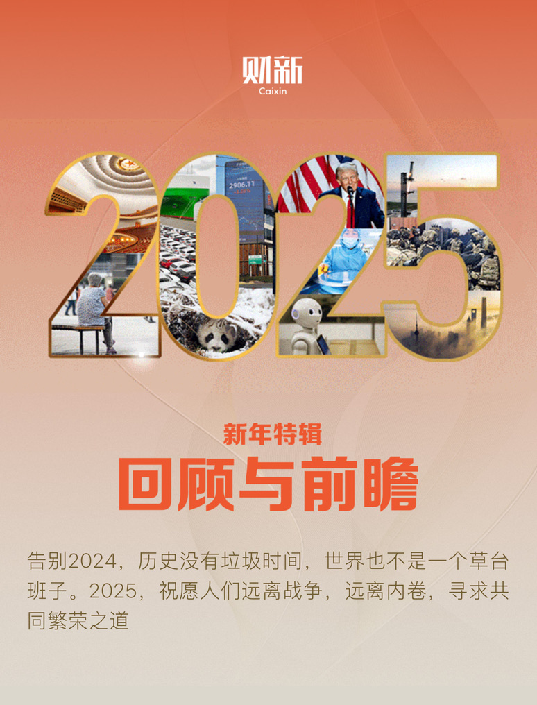
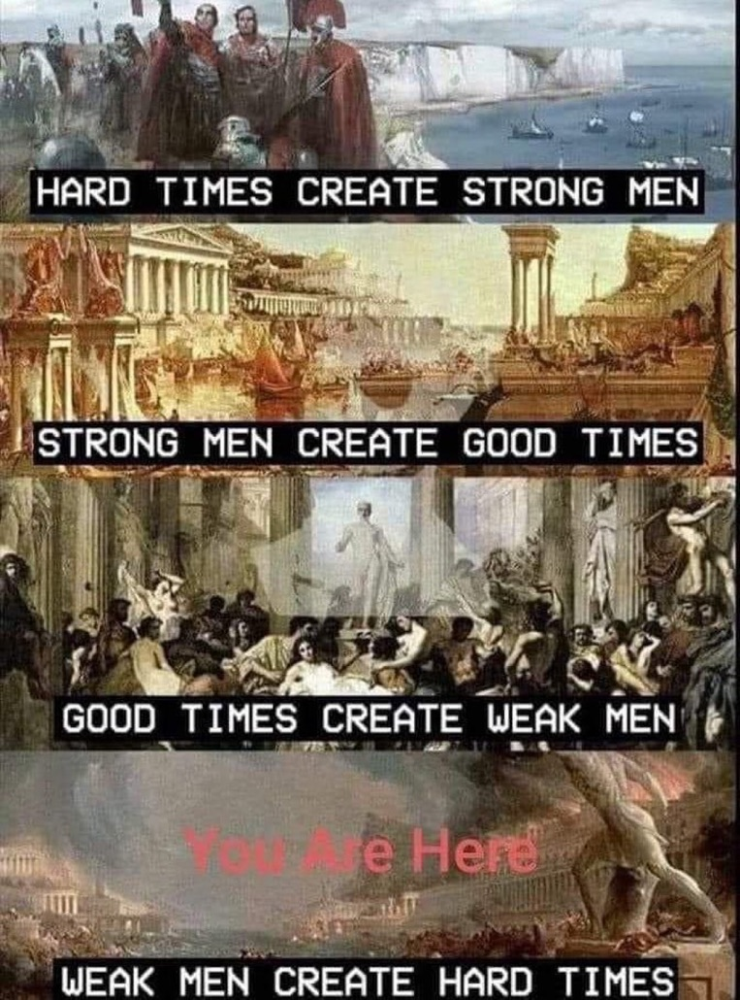

# 历史的智慧

财新在 2024 年末发布了新年特辑——《回顾与前瞻》。《总序》的结尾有这样一句我特别喜欢——「告别 2024，历史没有垃圾时间，反而是更多的人开始从历史中寻找智慧。」

历史有没有垃圾时间？历史的智慧又是什么？

「垃圾时间」这一概念，常用于体育比赛。当比赛进入垃圾时间，通常意味着两点：一是比赛有结束时间且进入最后的倒计时；二是在最后的倒计时阶段，比分悬殊，失败已是大概率事件。

而「历史的垃圾时间」则并无明确定义。

资深媒体人胡文辉在描述「历史的垃圾时间」时，有如下阐述：

公元前 770 年西周覆灭、平王东迁洛阳后属于周朝的垃圾时间；249 年高平陵之变后属于曹魏的垃圾时间；878 年黄巢之乱后属于唐代的垃圾时间；1630 年崇祯处死袁崇焕后属于明代的垃圾时间；1600 年关原之战后属于丰臣政权的垃圾时间；1979 年戈尔巴乔夫决定入侵阿富汗后属于苏联的垃圾时间。

## 周期

历史自有周期，有上行有下行。倘若将下行期称为「垃圾时间」，未免失之偏颇。

历史走入上行期，然后经济与政治繁荣，一切美好近在眼前，世人以为未来无论如何都会如此，随后沉沦、放纵。此时问题显现，历史走入下行期，直至黑暗降临。此时有人毅然、刚直，拔出石中剑，劈开云雾，曙光降临，随后历史又步入上行期。如此往复。

马斯克去年在社交媒体上发过这样一张图：

足以阐释历史的周期。

中国人眼中的历史，亦是循环往复的——「合久必分分久必合，治久必乱乱旧必治」。无论是黄金时代的沉沦，还是黑暗时代的刚直，皆是人性使然。所谓历史之必然，亦是人性之必然。

相比于「历史的垃圾时间」，我则更喜欢「历史的恢复时间」这个称谓，历史并未进入倒计时。

## 偶然与必然

从此时刻回望，大历史之下，任何历史事件都能在其之前找到看似复合逻辑的成因。看似一切皆是必然。

但历史又何其复杂，结构性的问题背后，必然有结构性的历史成因。而单看结构性成因中的一件，谁能说其中没有偶然性的存在。

先说说发生在我身上的故事。

母亲多年以前，在未和我商榷的情况下，便给我们一家四口人买入养老保险。对此我和她抱怨过很多次，觉得她是在没有计算过的情况下，胡乱进行家庭资产的投资。父母都已年近 50，为保障日后的老年生活买入保险理所应当，但我和弟弟尚且年幼，这笔钱更应当被用在其它的价值投资之上。这是原因之一。之二便是，这笔保险的收益明显低于开始购入时前三年的通胀均值。更不必提如果算上我和我弟的教育通胀等其它因素。不如换作医疗保险加市场投资。跑不赢通胀的钱，不如现在就花掉。

但是对此事，现在的我有所改观。

近两年，保险公司为用户提供了体检服务。母亲上一次体检时一切健康，两个月前进行了第二次体检，发现甲状腺结节，并且该结节有 10%的概率为恶性。一个月后到杭州复查，确诊甲状腺乳头状癌。两星期后手术，成功去除癌细胞。

我知道母亲一定是那种如果没有单位或者保险公司提供体检就一定不会自费体检的人，如果没有买这份保险，她定不会在癌症早期就发现自己身患癌症。她定是像外婆家村子里的那些老人，在癌症晚期，癌细胞开始扩散，身体出现其它并发症时，才想起来看病，然后噩耗降临，坐等终结，或是一掷千金。

母亲住院时，我坐在她的床边再次聊起这笔保险投资。我说，我们家命里就没有这笔收益。

历史下行是必然，如同历史上行的必然一样，只是时间各有长短，程度各有强弱。你我身处历史之中，又无时不刻不受命运牵制。

人生种种，最恨不过，无可奈何。
