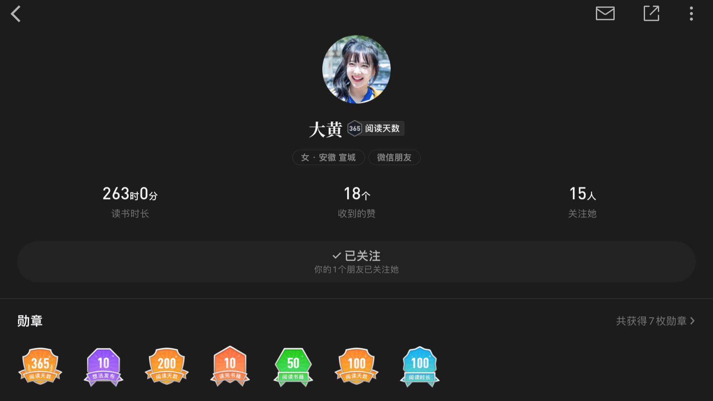
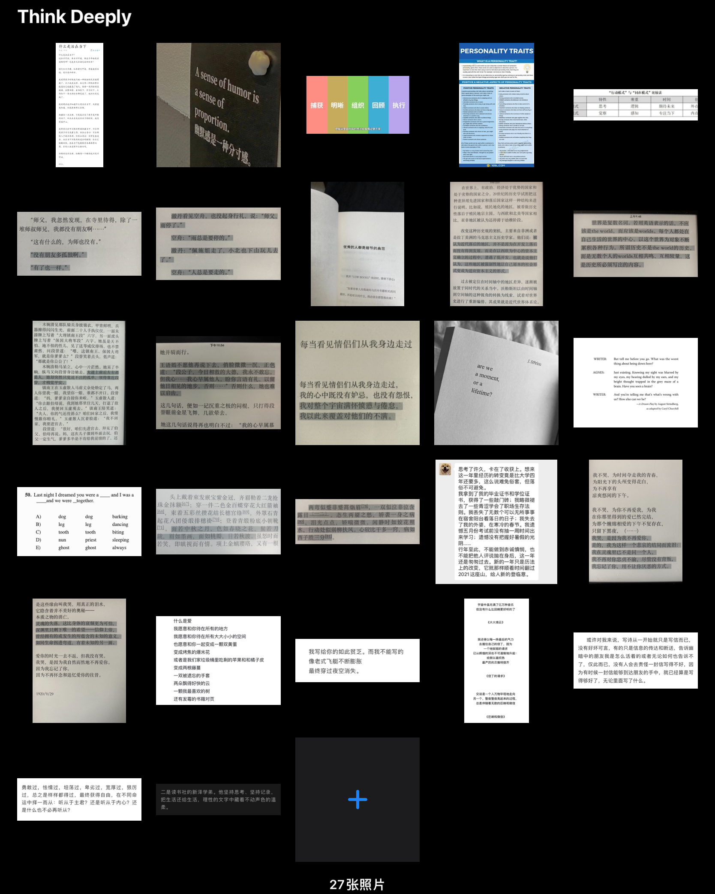

# 阅读不死

## 听说微信读书杀死了Kindle

今早看见36氪推文，《微信读书杀死了Kindle》。开篇第一行，“盖泡面神器Kindle，这次可能真的要快告别中国市场了。”

有点悲凉，但也是大势所趋。作为消费型电子产品，被移动设备逐渐取代是不可避免的。以往的MP3、MP4这类可移动设备，可以说已经完全被手机取代。照相机、音箱这类，对于非专业级，或者说没有特定需求的用户来说，手机仍是更好的选择。

类Kindle电子阅读器则是夹纸质书和类微信读书APP之间的东西。相较于纸质书，Kindle的优势就是它的存储、易携带。8G的内存就能存下上千本书，比手机大一点的体积，也总比一本书要小。相较于手机，电子墨水屏就弥补了手机看久了伤眼、强光下屏幕亮度不足的缺点。

但Kindle有很多地方饱受诟病。它的操作响应很慢，换书、搜索、键盘输入等功能使用起来，简直让人怀疑这是不是这个时代的电子产品。对于手机用起来卡一点就抓狂的用户来说，这一点就足以弃坑。更不用说它的功能单一、浏览器功能鸡肋、如果不想花钱买书还得手动导入书籍文档……

Kindle在北美那种知识至高、一本纸质书动不动就是几十美元的背景下都销量极差，更何况是在中国这种多平台、多竞品的环境里。

大概是大二的时候我下载过微信读书，看了3小时，但觉得手机屏幕太小，晚上看屏幕太刺眼，于是我又回到了Kindle。今天午饭后我又下载了微信读书，登陆就送了20天的免费卡。每周都有阅读任务，可以用阅读时长换取相应的免费时长或书币。对于喜欢阅读的用户来说，微信读书约等于白嫖书籍资源的平台。

07年生的Kindle被15年生的微信读书杀死，不过是MP3的历史重演罢了。

## 阅读，说到底也只是少数人的选择

我打开微信读书的微信好友列表，189位微信好友，只有40人注册使用微信阅读，多数都是刚注册，阅读时长不过几分钟。其中只有6位阅读时长超过10小时，且其中3位是我的老师，其余3人中也只有2人保持长期阅读。

这只是微信读书在我有限的社交环境中的数据，能体现的不多，通过纸质书、电子阅读器以及其它阅读平台的数据并不能在此体现。但微信读书的市场占有率很高，我所表述的数据足以体现，阅读也只是少数人的选择。

## 我的阅读

阅读并不高人一等，获取信息的途径有很多，和人交流、听讲座、看电影、看视频……现在在抖音和B站上兴起的泛知识类视频就广受好评。我只是更喜欢阅读而已。

初高中时阅读的多为纸质书。初中时也有使用过掌阅这款应用，可导入txt格式的文件，是那时看盗版网文小说不可不用的应用。

上大学后，纸质书的存放空间有限，所以走向了电子化阅读。18年入手Kindle，19年入手iPad。如果有书读后我十分喜欢，我会在网上买一本纸质书，邮寄回家里，存在书架上。

Kindle和iPad是我现在主要的阅读设备，过去一年里，我在Kindle上的阅读时间是87个小时，在iPad上的阅读时间没有数据，但应该在30-40小时。

两种设备所阅读的内容不同，两种设备所使用的阅读场景也不同。

Kindle大多用于阅读小说、诗集，因为需要摘录和做笔记的地方较少。遇到需要标注的地方，以往我会通过Kindle内置的txt文件导出到flomo。但是操作繁琐。现在我更习惯用手机拍照，然后保存到特定的相簿。

iPad多用于阅读学科知识类、英文原著等，因为方便标注、做笔记、查单词。

室外和睡前的阅读多用Kindle。有电子墨水屏，且体积小，十分适合放在口袋、胸包里带出门。自带的阅读灯亮度调至6，很适合关灯后的阅读，不刺眼。

## 阅读不死

Kindle将死，但，阅读不死。文字，无论是从纸面上转移到屏幕上，还是从Kindle上转移到手机上，都只是载体变了，但它所包含的东西没变。

我阅读，一为求知，二为静心。
