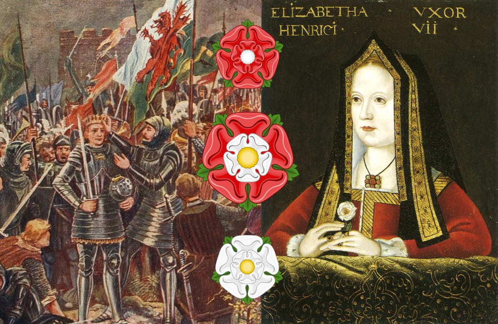

# 金雀花王朝的终结：玫瑰战争始末

亨利·佩恩（1868 - 1940）的《在古庙花园采摘红玫瑰和白玫瑰》。这幅画创作于 1908 年，原画现藏于威斯敏斯特宫，该画描绘了玫瑰战争爆发前夕，约克公爵理查德向第二代萨默塞特公爵埃德蒙·博福特发起挑战，要求他在约克家族的白玫瑰和兰开斯特家族的红玫瑰之间做出选择。这一虚构场景曾出现在莎士比亚的戏剧《亨利六世》（约 1591 年）中。

---

14 世纪末的英格兰风雨飘摇。国王理查德二世（爱德华三世的孙子）生性任性，治理无方，逐渐失去贵族支持。1399 年，他的堂兄亨利·博林布鲁克率军归国，推翻理查德二世，自立为王。

亨利四世是爱德华三世第三子约翰·冈特的后代，而理查德二世则是爱德华三世长子爱德华的独生子。按继承顺序，理查德二世死后，王位本应传给黑太子的弟弟莱昂内尔的后裔（即日后的约克家族）。然而，亨利四世以武力篡位，将这一继承顺序打乱。

兰开斯特家族带上王冠，但约克家族却始终认为自己才是英格兰王位的合法继承人。

## 短命的亨利们

亨利四世

亨利五世

亨利四世即位后，因其政权合法性问题而饱受叛乱困扰。他勉强维持王权，直至 1413 年死于癫痫，其子亨利五世继位。

年轻的亨利五世雄心勃勃，他将目光投向英吉利海峡对岸的法国。当时的法国，国王查理六世已患有精神病多时，两大权力派系奥尔良派与勃艮第派之间又冲突频频。于是亨利五世乘机重启与法国的战争，在 1415 年的阿金库尔战役中大败法军。此后几年，他几乎将法国北部收入囊中。1420 年，势如破竹的亨利五世迫使法国国王签订特鲁瓦条约（Treaty of Troyes），承认亨利为法国摄政王和法国王位继承人，随后他还与法国公主结婚。

然而，命运多舛。1422 年，年仅 35 岁的亨利五世骤然去世，留下九个月大的婴儿继承王位。

## 软弱的国王与强势的王后

亨利六世

亨利六世继位后不久，法国国王查理六世也去世，于是还在襁褓中的他便实现历代祖先的梦想——同时成为英格兰和法兰西的国王。

亨利六世性格温和仁弱，成年后的他更热衷于宗教与教育，而非战争与政治，他治下的英格兰饱受瘟疫和财政危机困扰，与此同时，英格兰在百年战争中的势头也渐渐衰退，法国逐渐收复失地。至 1453 年，英格兰几乎全线崩溃，只剩加来一隅（法国最终于 1558 年收复加来）。

英法战争的失败使得亨利六世出现了间歇性精神崩溃，常常无法执政，于是金雀花王朝的另一大家族领导人——约克公爵理查德（Richard of York, 3rd Duke of York）被议会任命为摄政王。这位约克公爵有着不低于亨利六世的王室血统，在成为摄政王之后，他便开始觊觎英格兰的王冠。

约克公爵

相较于软弱的国王，王后安茹的玛格丽特（Margaret of Anjou）则更为强势。在约克公爵的野心面前，她带领兰开斯特家族捍卫王冠的所有权。

## 玫瑰战争

玫瑰战争中大小战役

终于，1455 年，英格兰内战的序幕在圣奥尔本斯拉开，约克公爵以「清君侧」之名，率军与国王的部队交锋。约克方获胜，双方很快达成调解。安茹的玛格丽特坚持不让儿子被剥夺继承权，约克公爵被迫回到爱尔兰军中任职。

1460 年，约克公爵重返英格兰，大获全胜，亨利六世本人被俘，王后仓皇北逃，兰开斯特的权力被限制在英格兰中北部。几个月后，议会认可约克公爵王位继承人的身份，并再次任命他为摄政王。

可惜命运女神没有眷顾这位野心勃勃的摄政王，同年 12 月，约克公爵亲率军队北上挑战兰开斯特，惨遭埋伏身亡。兰开斯特为他戴上纸王冠，嘲讽他的实力无法承担王冠的重量，还将他的首级悬在约克郡的城墙上示众。

约克公爵的死亡令局面骤变，约克家族王位继承人的身份动摇，但野心不减。约克公爵年仅 16 岁的长子爱德华接过父亲的旗帜。1461 年初，爱德华率军东返，先在莫蒂默十字路击败兰开斯特残部，紧接着与国王军在陶顿展开决战。那是一场残酷的雪中厮杀，数万士兵倒下。混战中，约克阵营的乔治·克拉伦斯公爵从一侧偷袭，使得兰开斯特军心大乱。最终，爱德华胜利，亨利六世逃往苏格兰，爱德华在约克城加冕为爱德华四世。

爱德华四世

爱德华四世与在图克斯伯里修道院的兰开斯特家族逃亡者

约克王朝开始后不久，「造王者」沃里克伯爵因不满爱德华四世迎娶身份低微，且曾嫁给过兰开斯特王朝拥护者的伊丽莎白·伍德维尔（Elizabeth Woodville），以及爱德华四世不情愿他的兄弟克拉伦斯公爵乔治（George, Duke of Clarence）迎娶自己的女儿，而联手克拉伦斯公爵发动叛变。

起初，沃里克伯爵的反叛军击败并扣押了爱德华四世，但随后，爱德华四世的另一个弟弟格洛斯特公爵领着大军前来解救国王，沃里克伯爵和克拉伦斯公爵战败，并逃往法兰西。在法兰西国王的建议下，曾经互为敌人的沃里克伯爵与前王后安茹的玛格丽特结成联盟。

1470 年，满目疮痍的英格兰陷入又一轮血战，沃里克伯爵在法国集结军队，身处英格兰北部的沃里克伯爵弟弟加入了兰开斯特阵营。兰开斯特南北夹击，顺利击败爱德华四世。爱德华四世和格洛斯特公爵被迫流亡勃艮第。亨利六世复辟。

然而，命运女神终究更眷顾爱德华四世。1471 年 3 月，他带兵返回英格兰。4 月 14 日爱德华四世在巴尼特击杀沃里克伯爵，约克军大获全胜。5 月 4 日风云再起，兰开斯特与约克在格洛斯特郡的蒂克斯伯里兵戎相见，兰开斯特大败。亨利六世的王后和王子双双阵亡，拥护兰开斯特的贵族们被处死，亨利六世则被囚于伦敦塔。至此，兰开斯特直系后裔几近断绝，约克派再次全面掌权。

1483 年，爱德华四世骤然去世，王位传给年幼的儿子爱德华五世。然而，不到数月，国王和其弟弟神秘「失踪」于伦敦塔，被后人称为「塔中王子」。他们的叔父格洛斯特公爵自立为王，成为理查德三世。

理查德三世原以为约克王朝乃至整个金雀花王朝都已没有人可以与他争夺王冠，可没想到当年逃过爱德华四世抄家的兰卡斯特家族的远房亲戚——亨利·都铎(Henry Tudor)，如今已在法国累积足够势力，并宣称自己拥有王位继承权。

1485 年 8 月，两军在博斯沃思原野交战。关键时刻，理查德三世的盟友变节倒戈，亨利军获胜。理查德三世在战场上身死，成为最后一位阵亡于战场的英格兰国王。亨利·都铎加冕为亨利七世，开创都铎王朝。

亨利七世

为了稳固统治，亨利七世迎娶了爱德华四世的长女伊丽莎白·约克，将红玫瑰与白玫瑰合为一体，化为今日仍能见到的「都铎玫瑰」。

左：亨利·都铎在博斯沃思原野战役中击败理查德三世后称王；右：约克的伊莉莎白

上：代表兰开斯特家族的红玫瑰；下：代表约克家族的白玫瑰；中：代表都铎家族的都铎玫瑰

玫瑰战争中英格兰王室世系图

## Fire and Blood

Fire and Blood 是《冰与火之歌》前传的书名，是坦格利安家族的族语，也是坦格利安家族的命运。「Fire」象征龙的力量，同样昭示毁灭；「Blood」象征纯正血统，也暗喻流血的结局。凭借血统得到火焰，又因火焰而血流不止。

玫瑰的凋零与龙的咆哮，共同诉说着「权力永远在血与火中重生」。

## References

1. 金雀花王朝：缔造英格兰的武士国王与王后们，丹·琼斯(Dan Jones)
2. 空王冠：玫瑰战争与都铎王朝的崛起，丹·琼斯(Dan Jones)
3. 金雀花王朝 - Wikipedia [https://zh.wikipedia.org/wiki/%E9%87%91%E9%9B%80%E8%8A%B1%E7%8E%8B%E6%9C%9D]
4. House of Plantagenet - Wikipedia [https://en.wikipedia.org/wiki/House_of_Plantagenet]
5. 百年战争 - Wikipedia [https://zh.wikipedia.org/wiki/%E7%99%BE%E5%B9%B4%E6%88%98%E4%BA%89]
6. Hundred Years' War - Wikipedia [https://en.wikipedia.org/wiki/Hundred_Years%27_War]
7. House of Lancaster - Wikipedia [https://en.wikipedia.org/wiki/House_of_Lancaster]
8. House of York - Wikipedia [https://en.wikipedia.org/wiki/House_of_York]
9. Wars of the Roses - Wikipedia [https://en.wikipedia.org/wiki/Wars_of_the_Roses]
10. 金雀花王朝｜英國史(3) [https://aprilfooltw.com/ukhistory03/]
